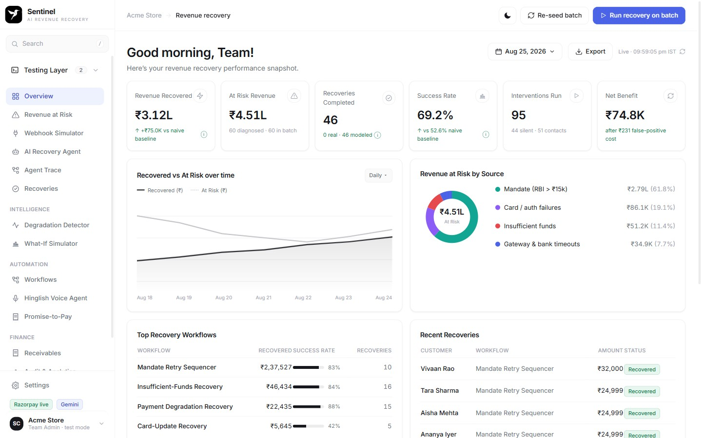
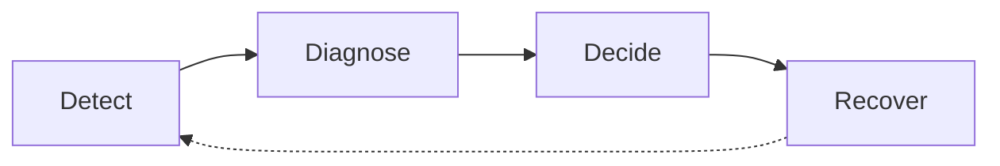
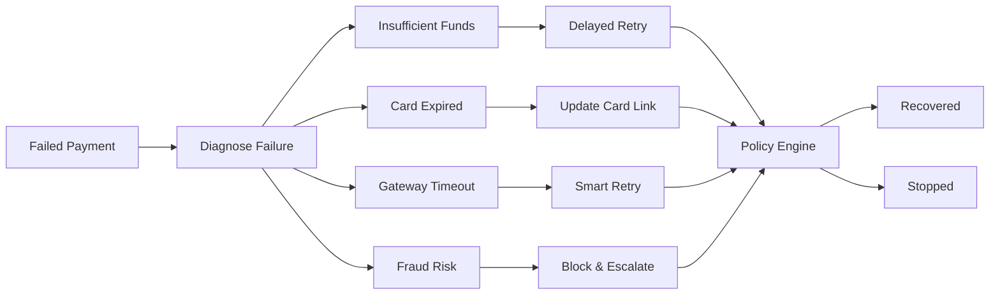
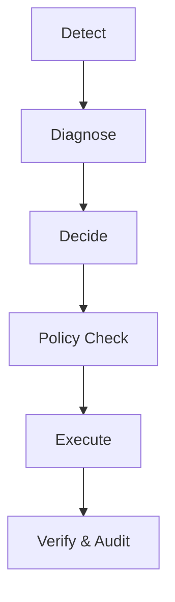
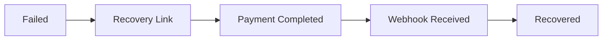

<p align="center">
  
</p>

<h1 align="center">Sentinel — AI Revenue Recovery</h1>

<p align="center">
  <em>Razorpay Hackathon · Track 03 — AI Revenue Recovery</em><br/>
  <em>Catch revenue before it's gone. Win it back — automatically, and safely.</em>
</p>

<p align="center">
  <a href="https://sentinel-gamma-one.vercel.app"><b>Live demo</b></a> ·
  <a href="https://sentinel-gamma-one.vercel.app/app/overview">Console</a> ·
  <a href="https://sentinel-gamma-one.vercel.app/docs">API docs</a> ·
  <a href="ARCHITECTURE.md">Architecture</a> ·
  <a href="EVALUATION.md">Evaluation</a>
</p>

<p align="center">
  
  
  
  
  
  
  
</p>

---

> **Try it in 30 seconds:** open the [live demo](https://sentinel-gamma-one.vercel.app) → **Open console** → **Run recovery on batch**.
> _(The API is on a free tier — the first request after it's been idle takes ~30–50s to wake, then it's instant.)_

**Sentinel is an AI agent that recovers revenue lost to failed payments — it detects a failure, diagnoses the _real_ reason, chooses one bounded recovery action, and executes it, with a deterministic policy engine enforcing every boundary and an immutable audit trail recording every step.**

## Results

| Metric | Result |
| --- | --- |
| Recovery Rate | **66.4%** |
| Money Recovered | **₹3.75L** |
| Improvement vs Baseline | **+₹90,505** |
| Fraud Cases Safely Blocked | **100%** |
| Wasted Retries Prevented | **123** |
| Cases Evaluated | **67** |

_Measured against a naive retry-everything baseline._

> **On reproducibility:** these figures come from one seeded batch and **shift on each
> re-seed** (the batch is regenerated). Reproduce any time with **Re-seed → Run recovery on
> batch**, then read `/api/metrics`. The live demo may show slightly different numbers than
> the table above for exactly this reason — baseline and Sentinel are always computed from
> the **same** constants, so the comparison stays fair.

<p align="center">
  
</p>

<p align="center"><em>The live console — money recovered, recovery rate vs baseline, net benefit, and every recovery it made.</em></p>

---

## The Problem

Indian subscription businesses lose revenue every day due to **involuntary churn**:

- Insufficient funds
- Expired cards
- Gateway failures
- RBI e-mandate authentication failures
- Payment risk blocks

Most systems blindly retry failed payments. **Blind retries waste money, annoy customers, and still fail to recover revenue.**

---

## Real Problem Solved — RBI e-Mandate Failures

### ₹15,000+ Mandate Authentication Failures

When recurring payments require additional customer authentication, **retrying cannot solve the problem.** Sentinel detects these cases, classifies them correctly, and routes them into a **mandate recovery workflow** instead of wasting retries.

| Metric | Result |
| --- | --- |
| Cases Detected | 12 |
| Cases Recovered | 11 |
| Revenue Recovered | ₹2,98,532 |
| Recovery Rate | **91.7%** |

_Highest-performing recovery workflow in the batch._

---

## From Failed Payment to Recovered Revenue

Four steps. One intelligent recovery loop. **No manual chasing. No blind retries.**



### Recovery Decision

Each failure is diagnosed into a class, mapped to one bounded action, and only executed if the policy engine allows it.



---

## How Sentinel Works



- The **AI diagnoses**.
- The **policy engine decides** what is allowed.
- The **tools execute**.
- Every action is **audited**.

---

## System Architecture

Sentinel separates diagnosis from execution. The LLM decides what happened; the policy engine decides what is allowed; tools execute only approved actions.

<p align="center">
  
</p>

### Components

- React + Vite Frontend
- Node.js + Express Backend
- SQLite + Prisma
- Claude → Gemini → Rules Fallback
- Razorpay Integration (test mode — real test-mode payment links)
- Twilio Voice _(test-mode / simulated when keys absent)_
- WhatsApp Recovery _(test-mode / simulated when keys absent)_
- Audit Layer

---

## AI Agent Design

### Diagnosis Engine

Claude → Gemini → Rules. Returns strict JSON:

```json
{
  "class": "...",
  "confidence": 0.92,
  "why": "...",
  "action": "..."
}
```

### Policy Engine

- Max 3 retries
- Max 3 contacts
- Never contact fraud
- Never touch paid cases
- TRAI calling window

### Tool Executor

**12 recovery tools.**

---

## Evaluation

### Measured, Not Marketed

| Metric | Sentinel | Baseline |
| --- | --- | --- |
| Recovery Rate | **66.4%** | 50.4% |
| Money Recovered | **₹3.75L** | ₹2.84L |
| Extra Revenue | **+₹90,505** | — |
| Retries Fired | **38** | 161 |
| Fraud Contacts | **0** | N/A |

### Dataset

- 67 failed payments
- Razorpay error schema
- 5 failure classes
- Realistic INR amounts
- Zero PII

---

## Example Recovery Story

### ₹48,000 Mandate Failure

| | |
| --- | --- |
| **Failure** | `mandate_afa_required` |
| **Diagnosis** | Mandate Re-Authentication Required |
| **Action** | `represent_mandate` |
| **Result** | Recovered |
| **Revenue** | ₹48,000 |

---

## Safety & Compliance

- Deterministic guardrails
- RBI-aware recovery flows
- TRAI call windows
- Fraud auto-block
- Idempotent execution
- Immutable audit trail

---

## Live Recovery Demo

Sentinel can generate a **real Razorpay test payment link**. When the payment is completed:



Dashboard metrics update automatically.

### See it for yourself — a real link Sentinel generated

This is an **actual** payment link Sentinel created by calling Razorpay's Payment Links API
for a failed **₹32,000** charge (customer _Vivaan Rao_):

> 💳 **[Click here to open the real Razorpay test checkout →](https://rzp.io/rzp/8wQFk0YK)**

It opens Razorpay's **test-mode** hosted checkout (`razorpay.com/payment-link/…/test`) — this
is exactly what the customer receives. **No real money moves.** Pay it with any Razorpay
[test card](https://razorpay.com/docs/payments/payments/test-card-details/) (e.g.
`4111 1111 1111 1111`, any future expiry, any CVV) and — with the webhook configured — the
case flips to **Recovered** on its own.

Under the hood, the agent's `create_payment_link` tool returned:

```json
{
  "tool": "create_payment_link",
  "result": {
    "url": "https://rzp.io/rzp/8wQFk0YK",
    "id": "plink_TWo99whbvLuZkB",
    "live": true
  }
}
```

`"live": true` means it's a real Razorpay test-mode link (not a simulated placeholder).

---

## Repository Structure

```
SENTINEL/
├── client/       # React + Vite console (landing + dashboard)
├── server/       # Node + Express API, agent, tests
│   ├── prisma/   # SQLite schema
│   └── src/      # agent, config, seed, index, tests
└── *.md          # QUICKSTART · DEPLOY · ARCHITECTURE · API · EVALUATION
```

---

## Quick Start

```bash
git clone https://github.com/Manvi0408/Sentinel.git
cd Sentinel
npm install
npm run setup
npm run seed
npm run dev
# open http://localhost:4100
```

Runs with **no keys** on the built-in rules engine. Add TEST-mode keys in
`server/.env` (copy from `server/.env.example`) to enable LLM diagnosis and real
Razorpay test links.

---

## Documentation

- [`QUICKSTART.md`](QUICKSTART.md)
- [`DEPLOY.md`](DEPLOY.md) — split backend/frontend deploy (Render + Vercel)
- [`ARCHITECTURE.md`](ARCHITECTURE.md)
- [`API.md`](API.md)
- [`EVALUATION.md`](EVALUATION.md)

---

## Key Insight

> **The reliability of an AI agent comes from what it is _not_ allowed to do.**

Sentinel puts the LLM behind a deterministic policy engine, making autonomous recovery **measurable, auditable, and safe.**
